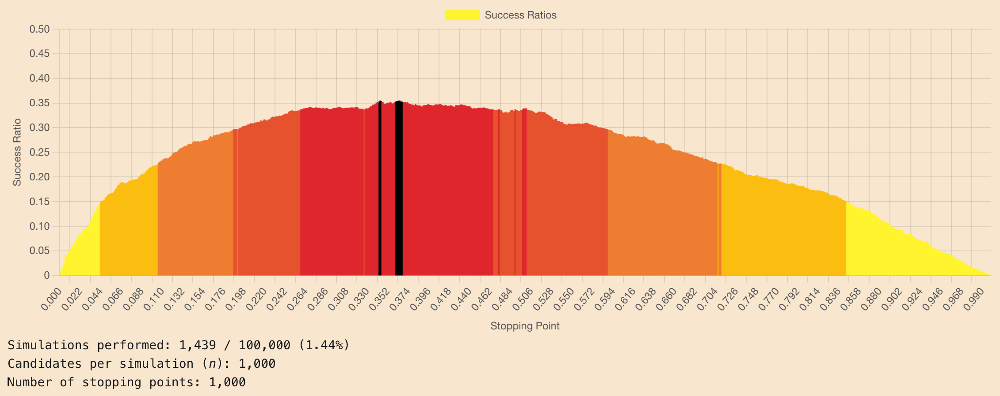

[](https://github.com/jduffey/secretary-problem/actions/workflows/merge_and_deploy.yml)
[](https://app.deepsource.com/gh/jduffey/secretary-problem/?ref=repository-badge)

# Secretary Problem Simulator

This application simulates the Secretary Problem, a classic problem in probability and decision-making. The problem involves an administrator trying to hire the best candidate among a pool of _n_ candidates. The challenge lies in making the hiring decision immediately after each interview, without knowing the quality of future candidates.

The app generates a bar chart that visualizes the success ratios of different stopping point strategies, using a brute-force approach. By running numerous simulations, the app demonstrates the optimal stopping point that maximizes the probability of selecting the best candidate. The stopping point is the ratio of candidates interviewed before allowing a selection to be made. The chart is designed to help users understand the optimal strategy to maximize the probability of selecting the best candidate.

Example chart :



## Setup

1. Install the required dependencies by running:

```
npm install
```

2. Start the application by running:

```
npm start
```

## Resources

- [Secretary Problem - Wikipeida](https://en.wikipedia.org/wiki/Secretary_problem)
- [Sultan's Dowry Problem - Wolfram Mathworld](https://mathworld.wolfram.com/SultansDowryProblem.html)